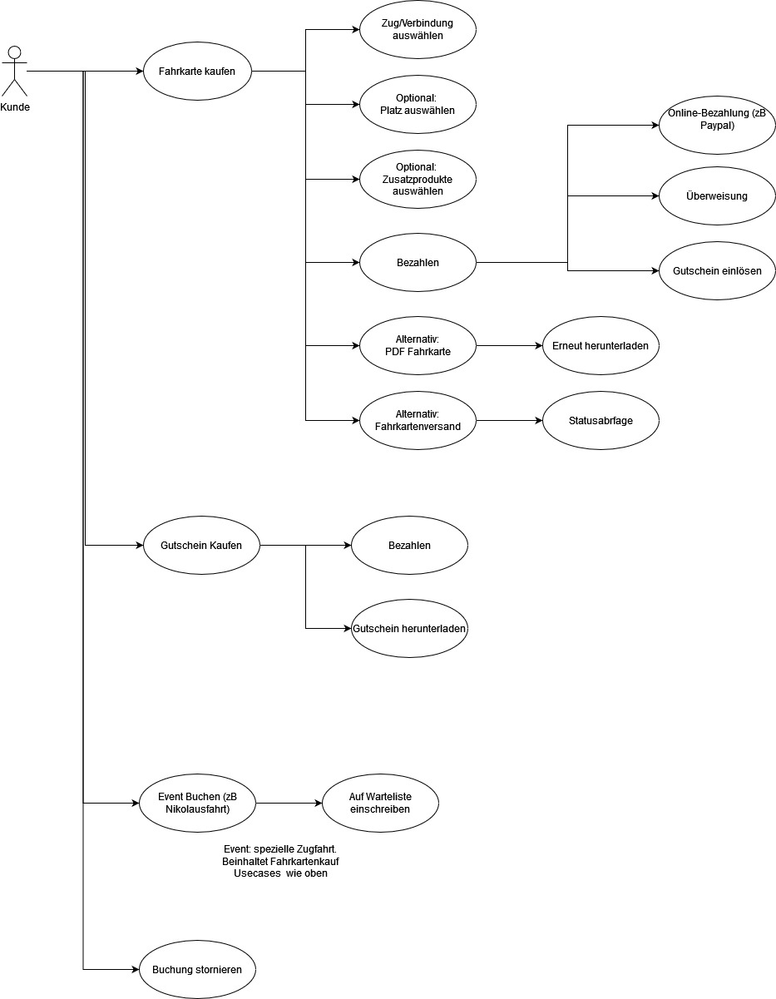
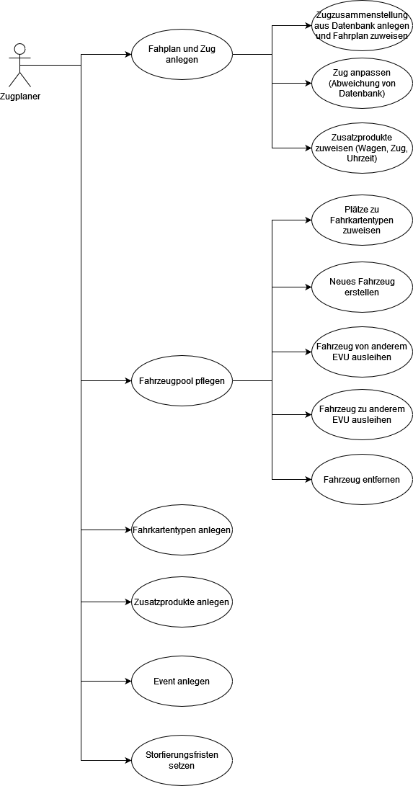
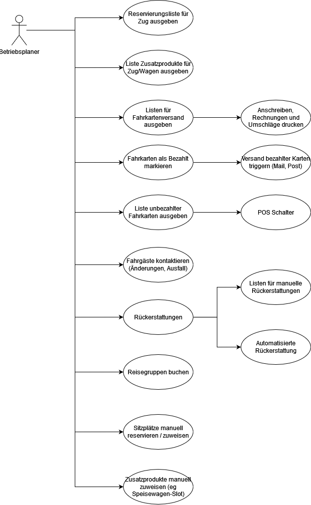
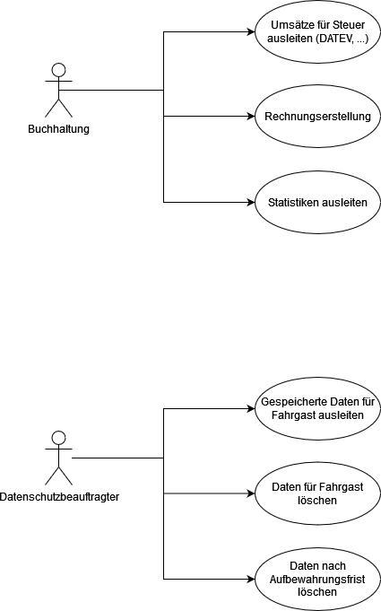

# Fahrkartenverkauf

## Allgemeines

Fahrkartenverkauf ist die Haupteinnahmequelle für die meisten Museumsbahnen und daher der Kern-Usecase, der effizient und schnell funktionieren muss. Der Fahrkartenverkauf verschiebt sich zunehmend Richtung online, für Museumsbahnen die auf DB Glleisen unterwegs sind ist er meistens schon komplett online.

### Problemstellung

Use Cases:

Folgende Szenarien müssen betrachtet werden:

#### Einzelfahrten komplett

- Einzelevents
- Karte für gesamte Fahrt (Hin- und Rückfahrt, kein Zu/Ausstieg an Zwischenstationen), fester Sitz, zwingende Reservierung
- optionale Geschenkpakete oder andere Zusatzpakete
- Pro Fahrgast nur eine Fahrkarte für Hin-/Rückfahrt
- Varianten:
  - Erwachsene / Kinder
  - 1. Klasse, 2. Klasse, Speisewagen (bei manchen Museumsbahnen auch noch 3. oder 4. Klasse)
  - ein oder mehrere Zusatzpakete ja / nein (Nikolauspaket, Essen, ...)
- Fahrgasttypen:
  - selber buchen: Einzelpersonen, Familien, Gruppen von 2 bis 20 Leuten
  - Vorreservieren über Anfrage: Reiseveranstalter mit großen Gruppen (bis zu 60, dann reservieren wir normalerweise einen kompletten Wagen)
- Nachbuchungen von Zusatzpaketen
- Umbuchungen/Stornierungen werden von Kunden gewünscht, von Veranstalterseite eher nicht weil sehr viel Aufwand
- Verkauf in einem definierten Zeitraum vor der Fahrt (Dauer bis zu 2 Monate, Abstand mind. 1 Monat) online
- Kontrolle durch Schaffner, Smartphone eventuell vorhanden, Netz schlecht bis gar nicht vorhanden

##### Sonderfahrten

- Einzelveranstaltungen
- Fahrt mit einem Zielpunkt (z.B. Prag), aber mehreren Einstiegspunkten (z.B. Nürnberg, Amberg, Regensburg) mit verschiedenen Preisen, Einzelstrecke oder Hin-/Rückfahrt als Paket
- Sitzplatzreservierung meistens verpflichtend
- Optional: Speisewagen Zeitslot reservierbar gegen Aufpreis, hier auch mit Platzreservierung im Speisewagen. Dieser Zeitslot muss mit Einstiegs-/Ausstiegszeitpunkt passen. (zB Wenn Einstieg in Nürnberg, dann Slot X, Y, Z; wenn in Amberg dann nur Y, Z möglich - hier auch Auslastungsoptimierung nötig - also Einstieg Nürnberg erst auf Slot X buchen)
- Varianten
  - Erwachsene / Kinder
  - 1. Klasse, 2. Klasse, eventuell weitere Klassen
  - Rabatte für Schwerbehinderte, andere,
  - Zusätzliche Rabatte für Frühbucher
  - Für Nikolausfahrten eventuell noch Geschenkpakete oder anderes zubuchbar
- Verkauf und Einlösen von Gutscheinen (für x Fahrkarten der Klasse Y zu beliebigem Datum)
- Verkauf bis direkt vor der Fahrt (eventuell auch nur 1 Tag vor der Fahrt) online
- Kontrolle durch Schaffner, Smartphone eventuell vorhanden, Netz schlecht bis gar nicht vorhanden

#### Planfahrten

- Während der Saison regelmäßige Fahrten
- mehrere Hinfahrten, mehrere Rückfahrten am Tag, die frei gewählt werden können
- Fahrkarten auf Teilstrecken möglich, Einstieg- und Ausstieg an jeder der X Haltestellen
- Sitzplatzreservierung optional in 2. Klasse , eventuell verpflichtend für 1. Klasse
- Varianten:
  - Einzelne Richtung
  - Verbilligte Hin/Rückfahrt
  - Erwachsene / Kinder (mit Zusatzrabatten, bei der DFS zb ist jedes 2. Kind Kostenlos)
  - 1. Klasse, 2. Klasse (bei anderen Museumsbahnen evtl 3. und 4. Klasse)
  - Rabatte für Schwerbehinderte, Ehrenamtskarte, Senioren
- Fahrgasttypen:
  - selber buchen: Einzelpersonen, Familien, Gruppen von 2 bis 20 Leuten,
  - Vorreservieren über Anfrage: Reiseveranstalter mit großen Gruppen (bis zu 60, dann reservieren wir normalerweise einen kompletten Wagen)
- Verkauf und Einlösen von Gutscheinen (für x Fahrkarten der Klasse Y zu beliebigem Datum)
- Verkauf bis direkt vor der Fahrt oder auch noch während der Fahrt online, kurz vor der Fahrt auch über Schalter
- Kontrolle durch Schaffner, Smartphone eventuell vorhanden, Netz schlecht bis gar nicht vorhanden

#### Fahrkarten-Arten

Manche Museumsbahnen verwenden konsistent Edmondsonsche Fahrkarten, die auch bei Online-Bestellungen per Post versandt werden. Andere verwenden PDFs zum selber ausdrucken, diese sollten aber ansprechend gestaltet werden können, da die Fahrt mit der Museumsbahn ein Event ist und die Fahrkarte auch gerne als Andenken aufgehoben wird. Manche Fahrgäste möchten aber auch nur Online Fahrkarten, ohne sie ausdrucken zu müssen.

Schwarzfahren oder Fahrkartenfälschung ist kein so großes Problem, zumindest fällt es bisher noch nicht auf.

### Nutzer:innen

#### Kundenseite

Fahrgäste aller Altersklassen, meistens nicht "digital native". Benutzt PC (gerne auch älter), Smartphone, Tablet. Versteht nicht viel von Eisenbahn, will einen schönen Tag mit der Familie/Freunden machen...

Usability ist sehr wichtig, da die Kunden einfach und schnell eine Fahrkarte kaufen wollen. Zu komplexe Benutzerführung führt dazu, dass sie sich per Telefon an die Museumsbahn wenden oder ganz auf die Fahrt verzichten.

#### Bahnseite

Stakeholder: Fahrkartenverkauf, Kassier, Steuerberater. Meistens auch keine "digital natives". Prinzipiell ist jeder manuelle Schritt zuviel, eigentlich wollen wir uns nicht mit Software beschäftigen.

### Technische Anforderungen

## Anwendungsfälle

## Stakeholder und Kontaktpersonen

## Lösungsansätze

### Fahrkartendrucker.de

Der Fahrkartendrucker entstand gegen 2011 auf Initative des VMDT, der die Entwicklung in den ersten Jahren finanziell förderte. Hinter dem Fahrkartendrucker steht die Schienenweb GmbH, die aus zwei Personen aus der Museumsbahn-Szene besteht. Fahrkartendrucker ist ein "Software as a Service" Angebot, das sich über Anteile am Fahrkartenpreis finanziert (2.5% für VDMT Mitglieder, 3% für nicht-Mitglieder [CHECK!]). Selbsthosten ist nicht möglich.

#### Vorteile

- etablierte Lösung
- speziell für Museumsbahnen entwickelt
- Nutzercommunity trifft sich regelmäßig auf VDMT Tagung

#### Nachteile

- nur ein Entwickler (der das neben dem Hauptberuf macht), Anpassungen dauern
- Frontend-Customizing schwierig
- Standard-Einstellung des Frontends sehr altbacken, nicht barrierefrei und nicht responsive
